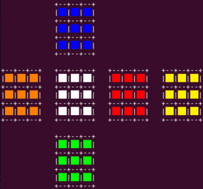
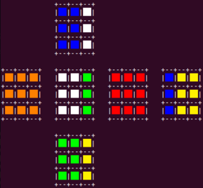
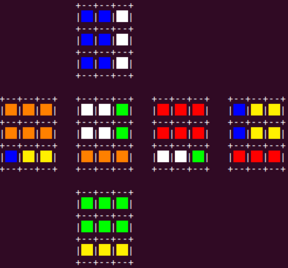

# Rubik's Cube rotations

## About
This project was created to simulate a series of Rubic's cube rotations. A full
cycle runs in iterations to count the number to get back to the initial state.
The series comprises two actions: rotate right side clockwise, then rotate down
side clockwise. In common notation:
```
RD
```

The project features:
- 2D unfolded cube representation of 6 sides
- color output in terminal

## Show case
First, the start state:


Next rotate right side clockwise:


After that, rotate down side clockwise, completing one full cycle:

